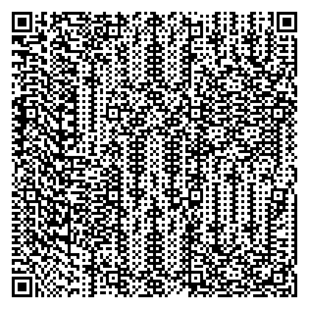

# QR Code Generator Application

## Overview
This QR Code Generator application creates a QR code from a given URL or any other data input and saves it as an image file on your system. In this project, the generated QR code links to the following LinkedIn profile:

`https://www.linkedin.com/in/prince-kumar-jha-037568285/`

The application utilizes the `qrcode` Python library to generate the QR code and `os` for handling file paths and directories.

## Features
- Generates a customizable QR code.
- Allows you to specify the size, border, and colors of the QR code.
- Automatically creates the directory to save the QR code image if it doesn't exist.

## Prerequisites
- Python 3.x
- `qrcode` library

## Installation
1. Install Python from the official website: [https://www.python.org/downloads/](https://www.python.org/downloads/)
2. Install the required `qrcode` library by running the following command:

```bash
pip install qrcode[pil]
```

## How to Use
1. Clone or download the project files.
2. Open the `QR_Generator.py` file in your preferred code editor.
3. Modify the data to be added to the QR code as needed. For example, change the LinkedIn URL to your desired link:

```python
pj.add_data("https://your-desired-link.com")
```

4. Run the script:

```bash
python QR_Generator.py
```

5. The QR code image will be saved in the specified path:

```
C:/Users/jhap9/OneDrive/Desktop/dev vscode/Projects/QR Generator/QR.png
```

## Customization Options
- **Version**: Controls the size of the QR code (from 1 to 40). A higher version generates a larger QR code.
  ```python
  pj = qrcode.QRCode(version=20, error_correction=qrcode.constants.ERROR_CORRECT_L, box_size=5, border=4)
  ```
- **Error Correction**: Determines how much damage the QR code can sustain and still be readable. Options include:
  - `ERROR_CORRECT_L`: About 7% error correction.
  - `ERROR_CORRECT_M`: About 15% error correction.
  - `ERROR_CORRECT_Q`: About 25% error correction.
  - `ERROR_CORRECT_H`: About 30% error correction.
- **Box Size**: Specifies the size of each individual box in the QR code.
- **Border**: Sets the thickness of the border around the QR code.
- **Colors**: Customize the fill and background colors of the QR code image:
  ```python
  img = pj.make_image(fill_color="black", back_color="white")
  ```

## Directory Handling
The application ensures that the specified directory exists before saving the QR code image. It uses the `os.makedirs()` function to create any missing directories:

```python
os.makedirs(os.path.dirname(save_path), exist_ok=True)
```

## Output
The generated QR code will be saved as `QR.png` in the specified path. You can scan this QR code using any QR code scanner application to verify its content.

## Example QR Code Output
| QR Code |
|--------|
|  |

## Future Enhancements
- Add a GUI using a library like Tkinter or PyQt for easier interaction.
- Enable users to input their own data directly into the application.
- Provide more customization options for colors and sizes.

## License
This project is open-source and available for modification and distribution under the MIT License.

---
**Developed by:** Prince kr. Jha

